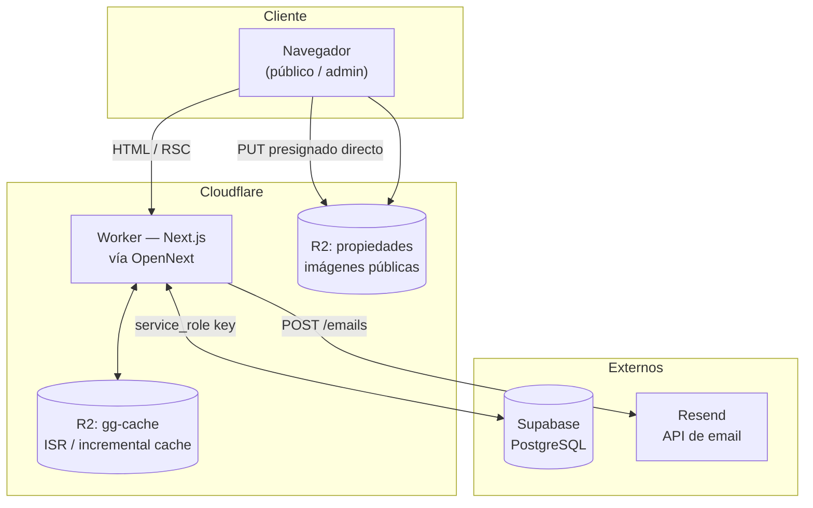
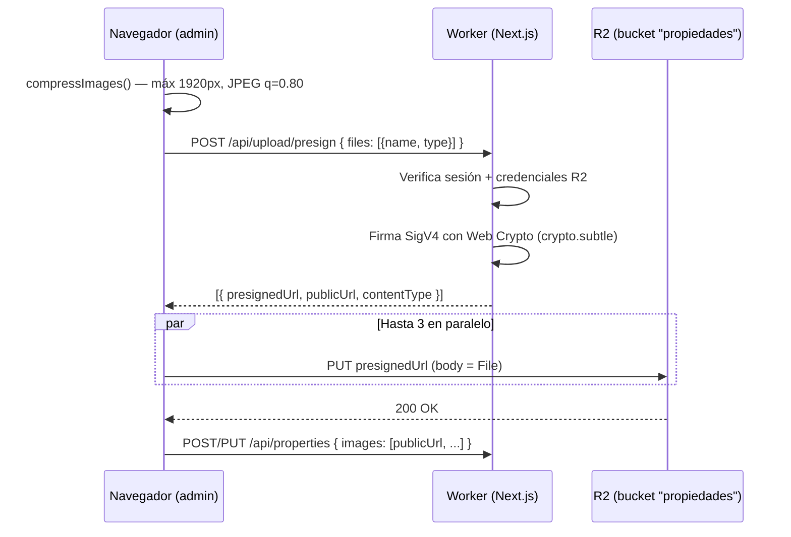

<div align="center">


# GG Propiedades

**Sitio web e intranet de administración de una inmobiliaria especializada en barrios cerrados y countrys de la Zona Norte del GBA.**

[](https://nextjs.org)
[](https://react.dev)
[](https://www.typescriptlang.org)
[](https://tailwindcss.com)
[](https://workers.cloudflare.com)
[](https://supabase.com)

[ggpropiedades.com](https://ggpropiedades.com)

</div>

---

## Tabla de contenidos

- [Qué es este proyecto](#qué-es-este-proyecto)
- [Stack tecnológico](#stack-tecnológico)
- [Arquitectura](#arquitectura)
- [Estructura del repositorio](#estructura-del-repositorio)
- [Puesta en marcha local](#puesta-en-marcha-local)
- [Variables de entorno](#variables-de-entorno)
- [Scripts disponibles](#scripts-disponibles)
- [Modelo de datos](#modelo-de-datos)
- [Rutas de la aplicación](#rutas-de-la-aplicación)
- [API interna](#api-interna)
- [Panel de administración](#panel-de-administración)
- [Subida de imágenes (R2)](#subida-de-imágenes-r2)
- [Caché y revalidación](#caché-y-revalidación)
- [SEO y visibilidad en IA](#seo-y-visibilidad-en-ia)
- [Seguridad](#seguridad)
- [Deploy](#deploy)
- [Convenciones y notas de mantenimiento](#convenciones-y-notas-de-mantenimiento)

---

## Qué es este proyecto

Aplicación web completa de **GG Propiedades**, inmobiliaria con oficina en el km 49,5 de Panamericana (La Lonja, Pilar). El sitio cubre dos audiencias en un mismo código base:

| Público | Qué hace |
|---|---|
| **Visitante** | Explora el catálogo de propiedades, filtra por zona / tipo / precio / dormitorios / amenities, ve fichas individuales con galería, y envía consultas por formulario o WhatsApp. |
| **Administración** | Entra a `/admin` con usuario y contraseña, carga y edita propiedades, sube fotos, y define cuáles aparecen destacadas en la home y en qué orden. |

Además hay una capa fuerte de **SEO local y GEO** (visibilidad en buscadores y en asistentes de IA): landings por zona, datos estructurados `schema.org`, sitemap dinámico, `robots.txt` con reglas explícitas para bots de IA y un `llms.txt`.

---

## Stack tecnológico

| Capa | Tecnología | Notas |
|---|---|---|
| Framework | **Next.js 16** (App Router) + **React 19** | Server Components por defecto, `"use client"` solo donde hace falta interactividad. |
| Lenguaje | **TypeScript 5** en modo `strict` | Alias de import `@/*` apuntando a la raíz. |
| Estilos | **Tailwind CSS v4** | Tokens de diseño en `@theme` dentro de `app/globals.css`, en espacio de color `oklch`. Paleta: negro azulado + dorado. |
| Tipografías | `next/font/google` | `Geist` (sans, UI) y `Playfair Display` (display, títulos). |
| Base de datos | **Supabase (PostgreSQL)** | Se accede vía `@supabase/supabase-js` con la **service_role key** desde el servidor. |
| Migraciones | **Prisma 7** | Se usa **solo como herramienta de esquema/migraciones**, no como cliente en runtime. |
| Autenticación | **NextAuth v4** — provider `Credentials` | Sesión JWT de 2 h, un único usuario admin definido por variables de entorno. |
| Almacenamiento | **Cloudflare R2** | Imágenes de propiedades. Firma AWS SigV4 propia hecha con Web Crypto. |
| Email | **Resend** (API HTTP) | Formulario de contacto → `info@ggpropiedades.com`. |
| Estado cliente | **TanStack Query v5** | Listado del panel admin. |
| Drag & drop | **dnd-kit** | Reordenamiento de propiedades destacadas. |
| Iconos | `lucide-react`, `react-icons` | |
| Hosting | **Cloudflare Workers** vía **OpenNext** | Adaptador `@opennextjs/cloudflare`. |

---

## Arquitectura



Puntos clave del diseño:

- **Todo el acceso a datos ocurre en el servidor.** El navegador nunca ve la `service_role key`: las páginas públicas son Server Components que consultan Supabase directamente, y el panel admin pasa por rutas de API protegidas por sesión.
- **Las imágenes no pasan por el Worker.** El servidor solo firma una URL de subida (`PUT` presignado, válida 5 minutos) y el navegador sube el archivo directo a R2. Eso evita el límite de tamaño de request y el consumo de CPU del Worker.
- **Optimización de imágenes desactivada** (`images.unoptimized: true` en `next.config.ts`): Cloudflare Workers no soporta el optimizador de Next.js, así que las imágenes se comprimen **en el cliente** antes de subirse (`app/lib/image-utils.ts`: máx. 1920 px, JPEG calidad 0.80) y se sirven ya optimizadas desde R2.
- **Dos buckets R2 distintos**: `propiedades` (imágenes, público) y `gg-cache` (caché incremental de Next.js, enlazado al Worker como `NEXT_INC_CACHE_R2_BUCKET`).

---

## Estructura del repositorio

```
.
├── app/
│   ├── actions/
│   │   └── featured.ts                 # Server Actions: destacar / ordenar destacadas
│   ├── admin/                          # Panel privado
│   │   ├── login/page.tsx              # Login (NextAuth Credentials)
│   │   ├── page.tsx                    # Dashboard
│   │   ├── PropertyList.tsx            # Listado + drag & drop de destacadas
│   │   └── properties/
│   │       ├── new/page.tsx            # Alta de propiedad
│   │       └── [slug]/edit/            # Edición de propiedad
│   ├── api/
│   │   ├── auth/[...nextauth]/         # Handler de NextAuth
│   │   ├── contact/route.ts            # Formulario de contacto → Resend
│   │   ├── properties/                 # CRUD admin (GET, POST, PUT, DELETE)
│   │   └── upload/presign/route.ts     # URLs firmadas de R2
│   ├── components/                     # Navbar, Footer, HeroCarousel, PropertyCard,
│   │                                   # ZoneLanding, Providers
│   ├── lib/
│   │   ├── auth-options.ts             # Config de NextAuth
│   │   ├── db.ts                       # Cliente Supabase (singleton) + tipo Property
│   │   ├── public-properties.ts        # Consultas públicas: home, listado, detalle, slugs
│   │   ├── image-utils.ts              # Compresión en cliente + subida concurrente a R2
│   │   ├── r2.ts                       # Firma AWS SigV4 con Web Crypto
│   │   ├── utils.ts                    # Formato de precio, zonas, mapeos, constantes
│   │   └── zone-content.ts             # Contenido editorial de las landings por zona
│   ├── propiedades/                    # Catálogo público + ficha de propiedad
│   ├── inmobiliaria-en-pilar/          # Landing SEO (Pilar)
│   ├── inmobiliaria-en-escobar/        # Landing SEO (Escobar)
│   ├── inmobiliaria-zona-norte/        # Landing SEO (Zona Norte)
│   ├── contacto/                       # Formulario de contacto
│   ├── aviso-legal/ politica-de-privacidad/
│   ├── politica-de-cookies/ terminos-y-condiciones/
│   ├── layout.tsx                      # Metadata global + JSON-LD RealEstateAgent
│   ├── globals.css                     # Tokens de diseño Tailwind v4
│   ├── robots.ts                       # robots.txt dinámico
│   └── sitemap.ts                      # sitemap.xml dinámico
├── prisma/
│   ├── schema.prisma                   # Modelo Property + enum Category
│   └── migrations/                     # Migraciones SQL versionadas
├── docs/
│   ├── guia-visibilidad-ia.md          # Guía operativa de SEO / GEO
│   └── superpowers/{plans,specs}/      # Planes y specs de features
├── public/                             # Logos, hero.jpg, llms.txt, favicons
├── .github/workflows/deploy.yml        # CI/CD a Cloudflare Workers
├── next.config.ts                      # Headers de seguridad + imágenes sin optimizar
├── open-next.config.ts                 # Caché incremental en R2
├── wrangler.toml                       # Config del Worker, bindings y vars
└── prisma.config.ts                    # Config de Prisma 7 (schema + migraciones)
```

---

## Puesta en marcha local

### Requisitos

- **Node.js 20** o superior
- Cuenta de **Supabase** con la tabla `Property` creada
- Cuenta de **Cloudflare** con un bucket R2 llamado `propiedades` (solo si vas a probar subida de imágenes)
- API key de **Resend** (solo si vas a probar el formulario de contacto)

### Pasos

```bash
# 1. Clonar
git clone https://github.com/Joakoali/gg-propiedades.git
cd gg-propiedades

# 2. Instalar dependencias (el postinstall corre `prisma generate`)
npm install

# 3. Crear el archivo de entorno local
cp .env.example .env.local   # o crearlo a mano con las variables de la tabla de abajo

# 4. Levantar el servidor de desarrollo
npm run dev
```

Abrí [http://localhost:3000](http://localhost:3000). El panel está en [http://localhost:3000/admin](http://localhost:3000/admin).

> [!IMPORTANT]
> `.env.local` está en `.gitignore` y **nunca** debe subirse al repositorio: contiene la `service_role key` de Supabase, que salta todas las políticas de Row Level Security.

---

## Variables de entorno

Todas las variables son **de servidor** (ninguna lleva el prefijo `NEXT_PUBLIC_`).

| Variable | Requerida | Descripción |
|---|:---:|---|
| `SUPABASE_URL` | ✅ | URL del proyecto, `https://<project>.supabase.co` |
| `SUPABASE_SERVICE_ROLE_KEY` | ✅ | Dashboard → Settings → API → `service_role`. **Secreto crítico.** |
| `NEXTAUTH_URL` | ✅ | `http://localhost:3000` en local, `https://ggpropiedades.com` en producción |
| `NEXTAUTH_SECRET` | ✅ | Cadena aleatoria para firmar el JWT (`openssl rand -base64 32`) |
| `ADMIN_USERNAME` | ✅ | Usuario del panel |
| `ADMIN_PASSWORD` | ✅ | Contraseña del panel |
| `R2_ACCOUNT_ID` | ⬜ | ID de cuenta de Cloudflare (necesaria para subir imágenes) |
| `R2_ACCESS_KEY_ID` | ⬜ | Token de acceso S3 de R2 |
| `R2_SECRET_ACCESS_KEY` | ⬜ | Secreto del token S3 de R2 |
| `R2_PUBLIC_URL` | ⬜ | URL pública del bucket, ej. `https://pub-xxxx.r2.dev` |
| `RESEND_API_KEY` | ⬜ | API key de Resend (necesaria para el formulario de contacto) |
| `DATABASE_URL` | ⬜ | Cadena de conexión Postgres de Supabase. **Solo** para correr migraciones de Prisma. |

Las variables marcadas ⬜ son opcionales en desarrollo: sin ellas la app funciona, pero la ruta correspondiente devuelve `503` (`/api/upload/presign` y `/api/contact`).

**En producción** las variables no sensibles viven en `wrangler.toml` (`[vars]`) y las sensibles se cargan como secrets:

```bash
npx wrangler secret put SUPABASE_SERVICE_ROLE_KEY
npx wrangler secret put NEXTAUTH_SECRET
# ... y así con cada secreto listado en wrangler.toml
```

---

## Scripts disponibles

| Script | Qué hace |
|---|---|
| `npm run dev` | Servidor de desarrollo de Next.js en `localhost:3000` |
| `npm run build` | Build de producción de Next.js (forzando webpack: `next build --webpack`) |
| `npm start` | Sirve el build de Next.js localmente (sin el runtime de Workers) |
| `npm run preview` | Build de OpenNext + preview local **en el runtime real de Workers** |
| `npm run deploy` | Build de OpenNext + deploy a Cloudflare Workers |
| `npm run lint` | ESLint (`eslint-config-next`) |
| `npm run cf-typegen` | Regenera los tipos de los bindings de Cloudflare (`CloudflareEnv`) |
| `postinstall` | `prisma generate` — corre solo tras `npm install` |

> [!TIP]
> Antes de un deploy, usá `npm run preview` en lugar de `npm run dev`: el runtime de Workers no tiene todas las APIs de Node y hay errores que solo aparecen ahí.

---

## Modelo de datos

Una única tabla, `Property`, definida en [`prisma/schema.prisma`](prisma/schema.prisma):

| Campo | Tipo | Notas |
|---|---|---|
| `id` | `String` | PK. Se genera con `crypto.randomUUID()` desde la app. |
| `slug` | `String` | **Único**. Derivado del título (minúsculas, no alfanuméricos → `-`). Es la clave de todas las URLs públicas. |
| `title` | `String` | Máx. 200 caracteres |
| `price` | `Float?` | En USD. `null` = "consultar". |
| `category` | `Category` | Enum: `houses` \| `lots` \| `local` |
| `description` | `String` | Máx. 10.000 caracteres |
| `images` | `String[]` | URLs absolutas HTTPS, validadas contra una allowlist de hosts |
| `bedrooms` | `Int?` | 0–50 |
| `coveredArea` | `Int?` | m² cubiertos |
| `semiCoveredArea` | `Int?` | m² semicubiertos |
| `lotArea` | `Int?` | m² de terreno |
| `neighborhood` | `String?` | Barrio / country |
| `zone` | `String?` | Zona (ver mapeo abajo) |
| `pool` | `Boolean` | Pileta |
| `financing` | `Boolean` | Acepta financiación |
| `mortgageEligible` | `Boolean` | Apto crédito hipotecario |
| `featured` | `Boolean` | Aparece en la home (máx. **9**, constante `MAX_FEATURED`) |
| `featuredOrder` | `Int?` | Posición 1–9 dentro de las destacadas |
| `createdAt` | `DateTime` | Default `now()` |

### Índices

Definidos en la migración `20260401195000_add_property_indexes`:

- B-tree en `(featured, createdAt DESC)`, `(category, createdAt DESC)`, `price` y `bedrooms` — cubren los filtros y ordenamientos del catálogo.
- **GIN + `pg_trgm`** en `title` y `zone` — hacen usables las búsquedas `ILIKE '%texto%'` a escala.

### Mapeo de zonas

El campo `zone` de la base no coincide 1:1 con los filtros que ve el usuario. La traducción vive en [`app/lib/utils.ts`](app/lib/utils.ts):

```ts
ZONE_FILTER_MAP = {
  "Pilar":                 ["Pilar", "La Cañada"],
  "Escobar":               ["Escobar"],
  "Cardales":              ["Cardales", "Campana"],
  "Exaltación de la Cruz": ["Exaltación de la Cruz"],
}

// Barrios que se muestran en más de una zona
CROSS_ZONE_NEIGHBORHOODS = {
  "Pilar":   ["San Sebastián"],
  "Escobar": ["San Sebastián"],
}
```

Al filtrar por zona, `applyFilters()` arma una condición `OR` que combina los valores de `zone` mapeados con un `ILIKE` sobre `neighborhood` para los barrios que cruzan zonas.

### Migraciones

Prisma se usa **solo** para gestionar el esquema. En runtime la app habla con Supabase por HTTP, no con Prisma Client.

```bash
# Requiere DATABASE_URL apuntando al Postgres de Supabase
npx prisma migrate dev --name descripcion_del_cambio
npx prisma migrate deploy   # aplicar en producción
```

> [!WARNING]
> El campo `featuredOrder` existe en la base y se usa en el código, pero **todavía no está reflejado en `schema.prisma` ni en una migración**. Si corrés `prisma migrate dev`, Prisma va a detectar el desfasaje e intentar eliminar la columna. Agregá `featuredOrder Int?` al modelo antes de generar cualquier migración nueva.

---

## Rutas de la aplicación

### Públicas

| Ruta | Render | Descripción |
|---|---|---|
| `/` | ISR 60 s | Home: hero carousel, hasta 9 destacadas ordenadas por `featuredOrder`, total de propiedades |
| `/propiedades` | ISR 60 s | Catálogo con filtros por query string y paginado de 12 |
| `/propiedades/[slug]` | ISR 60 s + `generateStaticParams` | Ficha: galería, características, JSON-LD, botones de WhatsApp y compartir. Las 12 destacadas se pre-generan en build. |
| `/inmobiliaria-en-pilar` | ISR 1 h | Landing SEO de Pilar |
| `/inmobiliaria-en-escobar` | ISR 1 h | Landing SEO de Escobar |
| `/inmobiliaria-zona-norte` | ISR 1 h | Landing SEO del corredor Pilar–Escobar |
| `/contacto` | Estática | Formulario de consulta / tasación |
| `/aviso-legal`, `/politica-de-privacidad`, `/politica-de-cookies`, `/terminos-y-condiciones` | Estáticas | Páginas legales |
| `/sitemap.xml` | ISR 1 h | Estáticas + una URL por propiedad |
| `/robots.txt` | Estática | Reglas para crawlers, incluidos bots de IA |

Las tres landings de zona comparten el componente [`ZoneLanding`](app/components/ZoneLanding.tsx) y se alimentan de [`app/lib/zone-content.ts`](app/lib/zone-content.ts), donde vive todo el contenido editorial (intro, barrios, tabla de precios orientativos, FAQs, enlaces relacionados). **Para editar el texto de una landing no hace falta tocar JSX**: se edita el objeto `ZONE_CONTENT`.

### Filtros del catálogo

`/propiedades` acepta estos parámetros de query, todos normalizados y acotados en `normalizePublicFilters()`:

| Parámetro | Valores |
|---|---|
| `category` | `houses` \| `lots` \| `local` |
| `zone` | `Pilar` \| `Escobar` \| `Cardales` \| `Exaltación de la Cruz` |
| `q` | Texto libre, máx. 120 caracteres (busca en `title`) |
| `minPrice` / `maxPrice` | Números ≥ 0 |
| `minBedrooms` | Entero ≥ 0 |
| `pool` / `financing` / `mortgageEligible` | `1` para activar |
| `sort` | `price_asc` \| `price_desc` \| `bedrooms` \| vacío (destacadas + más recientes) |
| `page` | Entero ≥ 1 (12 por página) |

### Privadas

| Ruta | Descripción |
|---|---|
| `/admin/login` | Login |
| `/admin` | Dashboard con listado y reordenamiento de destacadas |
| `/admin/properties/new` | Alta de propiedad |
| `/admin/properties/[slug]/edit` | Edición de propiedad |

---

## API interna

Todas las rutas bajo `/api/properties` y `/api/upload` **exigen sesión**; sin ella devuelven `401 { error: "No autorizado" }`.

| Método | Endpoint | Auth | Descripción |
|---|---|:---:|---|
| `GET` | `/api/properties` | 🔒 | Listado para el panel (`Cache-Control: private, max-age=30`) |
| `POST` | `/api/properties` | 🔒 | Crea una propiedad. Genera `id` y `slug`, valida y recorta cada campo. |
| `PUT` | `/api/properties/[slug]` | 🔒 | Actualiza. `title` y `category` solo se pisan si vienen válidos. |
| `DELETE` | `/api/properties/[slug]` | 🔒 | Elimina. Devuelve `404` si el slug no existe. |
| `POST` | `/api/upload/presign` | 🔒 | Devuelve hasta 30 URLs `PUT` firmadas de R2 |
| `POST` | `/api/contact` | ⬜ | Envía la consulta por email. Rate limit: **5 por hora por IP**. |
| `*` | `/api/auth/[...nextauth]` | ⬜ | Handler de NextAuth |

Validaciones de entrada aplicadas en el servidor (no confían en el formulario):

- `title`: mínimo 3 caracteres, se recorta a 200
- `description`: se recorta a 10.000
- `category`: debe estar en la allowlist, si no cae a `houses`
- `bedrooms`: entero 0–50; el resto de los enteros, 0–999.999
- `images`: se descartan las URLs que no sean HTTPS de `pub-…r2.dev`, `ggpropiedades.com` o `www.ggpropiedades.com`
- `featuredOrder`: entero 1–9, y solo se guarda si `featured === true`

### `POST /api/contact`

```jsonc
// Request
{
  "name":    "Juan Pérez",      // 2–100 caracteres
  "email":   "juan@mail.com",   // validado por regex, máx. 254
  "phone":   "+54 11 ...",      // opcional, máx. 30
  "message": "Consulta..."      // 10–5000 caracteres
}
```

Respuestas: `200 { ok: true }` · `400` datos inválidos · `429` rate limit · `503` sin `RESEND_API_KEY` · `500` fallo de envío.

El HTML del email escapa todas las entidades (`esc()`) y se rechazan `\r` / `\n` en `name`, `email` y `phone` para prevenir header injection.

> [!NOTE]
> El rate limit usa un `Map` en memoria del proceso. En Cloudflare Workers eso significa **por instancia**, no global: es una barrera contra spam accidental, no contra un ataque coordinado. Si hace falta algo más estricto, el reemplazo natural es Durable Objects o KV.

---

## Panel de administración

Autenticación con **NextAuth v4 + provider `Credentials`**: un único par usuario/contraseña leído de `ADMIN_USERNAME` / `ADMIN_PASSWORD`. Sesión **JWT con vencimiento a las 2 horas** (`app/lib/auth-options.ts`), ventana deliberadamente corta para un panel administrativo.

Flujo de trabajo típico:

1. Login en `/admin/login`.
2. El dashboard lista todas las propiedades (TanStack Query contra `GET /api/properties`).
3. **Alta / edición**: formulario con todos los campos; las imágenes se comprimen en el navegador y se suben directo a R2 antes de guardar.
4. **Destacadas**: hasta 9 propiedades (`MAX_FEATURED`). El toggle es una Server Action (`toggleFeatured`) que verifica el límite contra la base antes de marcar. El orden en la home se define arrastrando las tarjetas (dnd-kit → `setFeaturedOrder`).

---

## Subida de imágenes (R2)



Detalles de implementación:

- **La firma SigV4 es propia** ([`app/lib/r2.ts`](app/lib/r2.ts)) y usa `crypto.subtle`, nativo en Workers — no se necesita el SDK de AWS ni `node:crypto`.
- La **clave de firma se cachea por día** (`_signingKeyCache`): 4 operaciones HMAC en el primer request del día y 1 sola por archivo después.
- Tipos permitidos: `image/jpeg`, `image/jpg`, `image/webp`, `image/png`. Cualquier otro cae a `image/jpeg`.
- Máximo **30 archivos por request**, con **3 subidas concurrentes**.
- Las URLs firmadas expiran a los **300 segundos**.
- Los archivos menores a 500 KB se suben sin recomprimir.
- La key en el bucket es `uploads/<timestamp>-<random>.<ext>`.

---

## Caché y revalidación

| Superficie | Estrategia |
|---|---|
| Home, catálogo, ficha de propiedad | ISR con `revalidate = 60` |
| Landings de zona, sitemap | ISR con `revalidate = 3600` |
| Fichas de destacadas | Pre-generadas en build (`generateStaticParams`, hasta 12) |
| `GET /api/properties` | `Cache-Control: private, max-age=30` |
| Caché incremental | Bucket R2 `gg-cache`, vía `r2IncrementalCache` de OpenNext |

No hay revalidación on-demand: las funciones `revalidatePublicPropertyData()` de las rutas de API son intencionalmente no-ops, con la invalidación delegada al `revalidate` de cada página. **Consecuencia práctica: un cambio en el panel tarda hasta 60 segundos en verse en el sitio público** (hasta 1 hora en las landings de zona).

---

## SEO y visibilidad en IA

El proyecto tiene una estrategia explícita de **GEO** (Generative Engine Optimization) documentada en [`docs/guia-visibilidad-ia.md`](docs/guia-visibilidad-ia.md).

- **Metadata global** en `app/layout.tsx`: título con `template`, description, keywords, canonical, Open Graph (`es_AR`), Twitter Card, y `robots` con `max-image-preview: large` y `max-snippet: -1`.
- **JSON-LD `RealEstateAgent`** en el `<head>` de todas las páginas: dirección, teléfono, horarios, redes sociales, ficha de Google Maps y `areaServed` como `GeoCircle` de 30 km.
- **JSON-LD por propiedad** en cada ficha, para Rich Results de inmuebles.
- **Landings por zona** con contenido editorial real: barrios, precios orientativos calculados sobre el catálogo publicado, y FAQs.
- **`robots.txt`** ([`app/robots.ts`](app/robots.ts)) que además del wildcard **lista explícitamente** los crawlers de IA — `GPTBot`, `OAI-SearchBot`, `ChatGPT-User`, `ClaudeBot`, `Claude-User`, `Claude-SearchBot`, `Google-Extended`, `PerplexityBot` — para que un cambio futuro en las reglas generales no los bloquee sin querer. Bloquea `/admin`, `/api/` y rutas señuelo de WordPress.
- **`llms.txt`** ([`public/llms.txt`](public/llms.txt)): resumen del negocio, contacto y páginas principales en formato legible para modelos.
- **Sitemap dinámico** con `lastModified` real por propiedad.
- **`preconnect` + `dns-prefetch`** al CDN de imágenes, para ahorrar 200–500 ms en la primera imagen.

> [!NOTE]
> Los códigos de verificación de Google Search Console y Bing Webmaster están comentados en `app/layout.tsx` (campo `verification`). Hay que pegarlos al dar de alta el sitio en cada herramienta.

---

## Seguridad

**Headers HTTP** aplicados a todas las rutas desde `next.config.ts`:

| Header | Valor |
|---|---|
| `X-Frame-Options` | `DENY` |
| `X-Content-Type-Options` | `nosniff` |
| `Referrer-Policy` | `strict-origin-when-cross-origin` |
| `X-Robots-Tag` | `noarchive` |
| `Strict-Transport-Security` | `max-age=31536000; includeSubDomains` |
| `Permissions-Policy` | `camera=(), microphone=(), geolocation=()` |
| `Content-Security-Policy` | `default-src 'self'`, `frame-ancestors 'none'`, `base-uri 'self'`, `form-action 'self'`, imágenes desde cualquier HTTPS |

**Otras medidas:**

- La `service_role key` **solo** existe en el servidor; ninguna variable lleva prefijo `NEXT_PUBLIC_`.
- Row Level Security habilitado en Supabase **sin políticas**: como la app entra siempre con `service_role` (que saltea RLS), cualquier acceso con `anon key` queda bloqueado por defecto. Toda tabla nueva debe crearse con RLS habilitado.
- Allowlist de hosts para URLs de imágenes: bloquea inyección de contenido remoto vía el campo `images`.
- Escapado de HTML y bloqueo de saltos de línea en el email de contacto.
- Rate limiting en `/api/contact`.
- Sesión admin de 2 horas.

---

## Deploy

### Automático (GitHub Actions)

[`.github/workflows/deploy.yml`](.github/workflows/deploy.yml) corre `npm ci` + `npm run deploy` en Ubuntu ante un push a la rama de deploy, o manualmente con `workflow_dispatch`.

Secrets requeridos en el repositorio (Settings → Secrets and variables → Actions):

```
CLOUDFLARE_API_TOKEN     CLOUDFLARE_ACCOUNT_ID     DATABASE_URL
SUPABASE_URL             SUPABASE_SERVICE_ROLE_KEY NEXTAUTH_SECRET
ADMIN_USERNAME           ADMIN_PASSWORD            RESEND_API_KEY
R2_ACCOUNT_ID            R2_ACCESS_KEY_ID          R2_SECRET_ACCESS_KEY
```

`NEXTAUTH_URL` y `R2_PUBLIC_URL` están hardcodeadas en el workflow por no ser sensibles.

> [!WARNING]
> El workflow escucha pushes a **`main`**, pero la rama por defecto de este repositorio es **`master`**. Tal como está, un push a `master` **no dispara el deploy**. Hay que unificar: cambiar el `branches: [main]` del workflow a `master`, o renombrar la rama por defecto.

### Manual

```bash
npm run preview   # Verificar en el runtime real de Workers antes de publicar
npm run deploy    # Build de OpenNext + wrangler deploy
```

### Infraestructura de Cloudflare

```bash
# Bucket de caché incremental (una sola vez, en la cuenta del Worker)
npx wrangler r2 bucket create gg-cache

# Bucket de imágenes (una sola vez)
npx wrangler r2 bucket create propiedades
```

Configuración del Worker en [`wrangler.toml`](wrangler.toml): nombre `gg-propiedades`, entrypoint `.open-next/worker.js`, `compatibility_flags = ["nodejs_compat"]`, assets estáticos desde `.open-next/assets` y binding `NEXT_INC_CACHE_R2_BUCKET` → `gg-cache`.

---

## Convenciones y notas de mantenimiento

- **Idioma**: código, comentarios y contenido en español. Los identificadores del modelo de datos están en inglés (`bedrooms`, `coveredArea`) por herencia del esquema de Prisma.
- **Server Components por defecto.** Poné `"use client"` solo cuando necesites estado, efectos o handlers de eventos.
- **Estilos**: Tailwind v4 con tokens `@theme` en `app/globals.css`. Los colores se usan como `var(--color-*)`, no como valores hardcodeados.
- **Precio en USD**, formateado con `Intl.NumberFormat("es-AR")` sin decimales (`formatPrice`). Un precio `null` se muestra como "consultar".
- **El `slug` se genera del título y es la URL pública.** Cambiar un título en el panel **no** regenera el slug de una propiedad existente (`PUT` no lo toca), lo cual preserva los enlaces ya indexados. Es intencional.
- **Contenido editorial de las landings** → `app/lib/zone-content.ts`, no en el JSX de cada página.
- **`docs/superpowers/`** guarda los planes y specs de features ya implementadas: sirven de historial de decisiones de diseño.
- `graphify-out/` y `.superpowers/` son artefactos de tooling local, no forman parte del build.

---

<div align="center">
<sub>GG Propiedades · Colectora Acceso Norte km 49,5, Edificio Concord Rubí Of. 302 — La Lonja, Pilar, Buenos Aires</sub>
</div>
